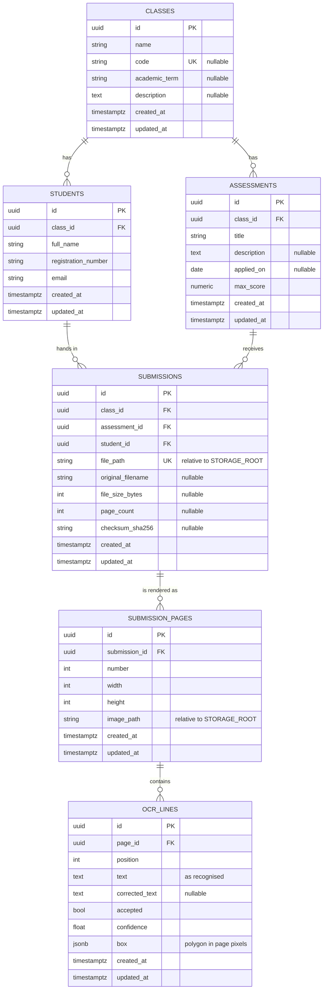

# GradeMate

GradeMate is a web tool that helps teachers grade scanned exams delivered as PDF files.

This repository is in an early stage. Teachers can register their classes, the students enrolled in
them and the assessments they will grade, upload the scanned exam each student handed in, and review
what the OCR read on every region of the page to build a plain-text transcript of the answers.
Scoring those answers is what comes next.

The application has no login: it is a single-teacher tool, so opening it goes straight to the list
of classes.

## Tech stack

| Concern          | Choice                                  |
| ---------------- | --------------------------------------- |
| Database         | PostgreSQL 16                           |
| Backend language | Python 3.11+                            |
| Web framework    | FastAPI                                 |
| ORM              | SQLAlchemy 2.0 (synchronous, psycopg 3) |
| Migrations       | Alembic                                 |
| Frontend         | React 19 + TypeScript + Vite            |
| Styling          | TailwindCSS 4 + shadcn/ui               |
| OCR              | PaddleOCR 3 (GPU), as its own service   |

## Data model



Rules enforced by the database:

- A student belongs to exactly one class; deleting a class deletes its students, assessments and
  submissions.
- `registration_number` and `email` are unique **within a class**, not globally, so the same person
  taking two different classes is stored as two rows.
- A class may have many assessments, and their titles are unique within the class.
- `max_score` must be greater than zero.
- A submission is one student's answered exam for one assessment: at most one per pair, and no two
  submissions may point at the same file.
- `submissions` carries a `class_id` used by two **composite** foreign keys
  (`assessment_id, class_id` and `student_id, class_id`). This makes it impossible to attach a
  student to an assessment that belongs to a different class.

## File storage

The exam PDFs are not stored in the database. They live on the `grademate_storage` Docker volume,
mounted into the backend container at `/data/storage` (`STORAGE_ROOT`); outside the container the
default is `./storage`.

`submissions.file_path` holds a path **relative** to that root, so remounting the volume elsewhere
never invalidates the rows:

```
<STORAGE_ROOT>/submissions/<assessment_id>/<student_id>.pdf
```

`app/core/storage.py` builds these paths (`submission_file_path`) and turns them back into absolute
ones (`resolve`, which refuses any path that escapes the storage root).

## OCR service

`services/ocr/` is a separate FastAPI service that wraps [PaddleOCR](https://www.paddleocr.ai/).
`docker compose up -d` starts it on <http://localhost:8001> (documentation at `/docs`).

It exposes **two engines**, because they read a page in very different ways:

| Endpoint  | Engine       | Returns                              | Per page | Confidence |
| --------- | ------------ | ------------------------------------ | -------- | ---------- |
| `/ocr`    | PP-OCRv6     | short **lines**                      | ~2 s     | yes        |
| `/ocr-vl` | PaddleOCR-VL | labelled **blocks**, markdown/LaTeX  | ~15 s    | no         |

PP-OCR is fast and fine on printed text. PaddleOCR-VL is a 0.9B vision-language model: much better
on handwriting, it transcribes mathematics as LaTeX and labels each region (`text`,
`inline_formula`, `display_formula`, `table`, `header`). Measured on a real handwritten exam, PP-OCR
read the student's name as *"Gluno: Joas bitor Paive Gomes"* while the VL read *"Aluno: Toas Victor
Paine Gomes"* and transcribed the matrices correctly.

Both engines load lazily and stay in memory; together they use about 5.5 GB of GPU memory.

```bash
curl -F "file=@exam.pdf" http://localhost:8001/ocr
curl -F "file=@exam.pdf" http://localhost:8001/ocr-vl
```

`/ocr` answers with one entry per page, and one entry per recognised line inside it:

```json
{
  "filename": "exam.pdf",
  "page_count": 1,
  "pages": [
    {
      "number": 1,
      "lines": [{ "text": "Question 1.", "confidence": 0.99, "box": [[86, 301], [201, 301], …] }]
    }
  ],
  "text": "Question 1.\n…"
}
```

`/ocr-vl` answers with `blocks` instead of `lines`, each carrying `label`, `content` and `box`.

The bounding boxes are what let GradeMate show the teacher where on the page an answer was found.
The service is stateless and never stores the uploaded file.

**Requirements.** The service is built for the GPU: it needs an NVIDIA card, a driver supporting
CUDA 12.6 and the `nvidia-container-toolkit` installed on the host. To run it on the CPU instead,
set `OCR_DEVICE=cpu` in `docker-compose.yml`, remove the `deploy.resources` block and replace
`paddlepaddle-gpu` with `paddlepaddle` in `services/ocr/Dockerfile`.

| Variable                       | Default | Purpose                                              |
| ------------------------------ | ------- | ---------------------------------------------------- |
| `OCR_LANG`                     | `pt`    | Recognition language (`pt`, `en`, `es`, `fr`, …)     |
| `OCR_DEVICE`                   | `gpu:0` | `gpu:0` or `cpu`                                     |
| `OCR_PRELOAD`                  | `false` | Load the models at startup instead of on first use   |
| `OCR_USE_DOC_ORIENTATION`      | `false` | Detect rotated pages (extra model)                   |
| `OCR_USE_DOC_UNWARPING`        | `false` | Flatten curved pages (extra model)                   |
| `OCR_USE_TEXTLINE_ORIENTATION` | `false` | Detect rotated text lines (extra model)              |

The model weights are downloaded on the first request into the `grademate_ocr_models` volume, so
that first call takes a few minutes while later ones do not. PaddleOCR-VL is around 2 GB, and its
first load takes several minutes.

## Getting started

Requirements: Docker (for PostgreSQL), Python 3.11+ and Node.js 20+.

```bash
# 1. Start PostgreSQL
docker compose up -d

# 2. Create a virtual environment and install the project
python3 -m venv .venv
.venv/bin/pip install -e ".[dev]"

# 3. Configure the environment
cp .env.example .env

# 4. Apply the migrations
.venv/bin/alembic upgrade head

# 5. Install the frontend dependencies
npm --prefix frontend install
```

## Running the application

Two processes, in two terminals:

```bash
# Terminal 1 - API on http://localhost:8000 (docs at /docs)
.venv/bin/uvicorn app.main:app --reload

# Terminal 2 - web interface on http://localhost:5173
npm --prefix frontend run dev
```

Open <http://localhost:5173>. Vite forwards every `/api` request to the backend, so the browser
only ever talks to one origin and no CORS configuration is needed.

Without Node.js installed, the same commands run inside a container:

```bash
docker run --rm --network host -u "$(id -u):$(id -g)" -e HOME=/tmp \
  -v "$PWD/frontend":/work -w /work node:22-alpine npm run dev
```

The interface follows the order a teacher works in: **class → students → assessment → exams**. The
landing screen lists the registered classes, and *New class* opens a three-step flow that saves each
step as it is completed.

Opening an assessment shows the class roster, one student per row, with the PDF each of them handed
in. Uploading again for the same student replaces the previous file, which is what happens after a
page is re-scanned. Uploads are limited to PDFs of at most `MAX_UPLOAD_MB` (25 by default) and are
checked by their file header, so a renamed document is rejected.

### Correcting an exam

*Correct* on a student's row opens the review screen. *Run OCR* rasterises every page of the PDF at
`PAGE_RENDER_DPI` (150 by default), sends those images to the OCR service and stores what comes
back. Because the image shown and the image read are the same raster, the boxes always sit exactly
on top of the handwriting.

The engine is picked on that screen: **PP-OCR** for speed, **PaddleOCR-VL** for handwriting and
mathematics. The stored regions remember which engine produced them, and a region read by the VL
carries its label and no confidence score.

The screen puts the page on the left, with one box per recognised line, and on the right the list of
lines. Each line can be **accepted** as it was read or **rewritten**; hovering either side highlights
the matching box. Accepted lines build the plain-text transcript below the list, which is what later
steps of the product will grade.

Corrections never overwrite the original: `ocr_lines.text` keeps the OCR reading and
`ocr_lines.corrected_text` holds the teacher's version. Running the OCR again discards the previous
reading and its corrections.

## Browsing the database

`docker compose up -d` also starts [Adminer](https://www.adminer.org/), a small web client for the
database, at <http://localhost:8080>. It is a development convenience, not part of the product.

| Field    | Value        |
| -------- | ------------ |
| System   | PostgreSQL   |
| Server   | `db`         |
| Username | `grademate`  |
| Password | `grademate`  |
| Database | `grademate`  |

The same credentials work from a desktop client (DBeaver, TablePlus, `psql`) using `localhost:5432`
as the server.

## Working with migrations

```bash
# Generate a new migration after changing the models
.venv/bin/alembic revision --autogenerate -m "describe the change"

# Apply / roll back
.venv/bin/alembic upgrade head
.venv/bin/alembic downgrade -1

# Fail if the models and the database schema have drifted apart
.venv/bin/alembic check
```

## Project layout

```
app/
  main.py               FastAPI application
  api/routes/           Endpoints for classes, students and assessments
  api/errors.py         Database constraint violations -> HTTP 409 messages
  schemas/              Request and response models (Pydantic)
  core/config.py        Settings loaded from environment variables / .env
  core/storage.py       Path helpers for the PDF storage volume
  db/base.py            Declarative base, UUID primary key and timestamp mixins
  db/session.py         Engine and session factory
  models/               ClassGroup, Student, Assessment, Submission, SubmissionPage, OcrLine
  services/ocr_client.py Calls the PaddleOCR service
frontend/
  src/pages/            One component per screen
  src/components/       Layout and the reusable sections of a class
  src/components/ui/    shadcn/ui primitives
  src/lib/api.ts        Typed client for the API
migrations/             Alembic environment and versioned migrations
docker-compose.yml      Local PostgreSQL instance, Adminer and the storage volume
```

## API

Interactive documentation is served at <http://localhost:8000/docs>.

| Method   | Path                             | Purpose                     |
| -------- | -------------------------------- | --------------------------- |
| `GET`    | `/api/classes`                   | List classes with counters  |
| `POST`   | `/api/classes`                   | Create a class              |
| `GET`    | `/api/classes/{id}`              | Retrieve a class            |
| `PATCH`  | `/api/classes/{id}`              | Update a class              |
| `DELETE` | `/api/classes/{id}`              | Delete a class and its data |
| `GET`    | `/api/classes/{id}/students`     | List the students           |
| `POST`   | `/api/classes/{id}/students`     | Add a student               |
| `PATCH`  | `/api/students/{id}`             | Update a student            |
| `DELETE` | `/api/students/{id}`             | Remove a student            |
| `GET`    | `/api/classes/{id}/assessments`  | List the assessments        |
| `POST`   | `/api/classes/{id}/assessments`  | Create an assessment        |
| `PATCH`  | `/api/assessments/{id}`          | Update an assessment        |
| `DELETE` | `/api/assessments/{id}`          | Delete an assessment        |
| `GET`    | `/api/assessments/{id}/submissions` | Exams uploaded for it    |
| `PUT`    | `/api/assessments/{aid}/students/{sid}/submission` | Upload/replace a PDF |
| `GET`    | `/api/submissions/{id}/file`     | Read the stored PDF         |
| `DELETE` | `/api/submissions/{id}`          | Delete a submission         |
| `GET`    | `/api/submissions/{id}/review`   | Pages and OCR lines stored  |
| `POST`   | `/api/submissions/{id}/ocr`      | Render the pages and read them |
| `GET`    | `/api/pages/{id}/image`          | The rendered page image     |
| `PATCH`  | `/api/ocr-lines/{id}`            | Accept or rewrite a line    |

Violating a database constraint returns `409` with a sentence the interface shows directly, for
example *"This registration number is already used by another student in this class."*

## License

See [LICENSE](LICENSE).
