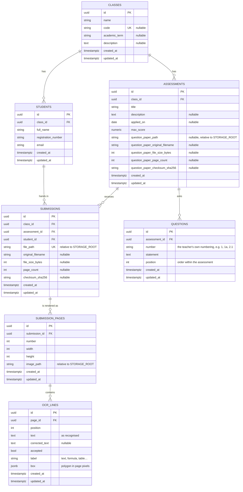

# GradeMate

GradeMate is a web tool that helps teachers grade scanned exams delivered as PDF files.

This repository is in an early stage. Teachers can register their classes, the students enrolled in
them and the assessments they will grade, upload the scanned exam each student handed in, and review
what the OCR read on every region of the page to build a plain-text transcript of the answers.
Scoring those answers is what comes next.

The application has no login: it is a single-teacher tool, so opening it goes straight to the list
of classes.

## Tech stack

| Concern          | Choice                                  |
| ---------------- | --------------------------------------- |
| Database         | PostgreSQL 16                           |
| Backend language | Python 3.11+                            |
| Web framework    | FastAPI                                 |
| ORM              | SQLAlchemy 2.0 (synchronous, psycopg 3) |
| Migrations       | Alembic                                 |
| Frontend         | React 19 + TypeScript + Vite            |
| Styling          | TailwindCSS 4 + shadcn/ui               |
| OCR              | PaddleOCR 3 (GPU), as its own service   |

## Data model



Rules enforced by the database:

- A student belongs to exactly one class; deleting a class deletes its students, assessments and
  submissions.
- `registration_number` and `email` are unique **within a class**, not globally, so the same person
  taking two different classes is stored as two rows.
- A class may have many assessments, and their titles are unique within the class.
- `max_score` must be greater than zero.
- A submission is one student's answered exam for one assessment: at most one per pair, and no two
  submissions may point at the same file.
- `submissions` carries a `class_id` used by two **composite** foreign keys
  (`assessment_id, class_id` and `student_id, class_id`). This makes it impossible to attach a
  student to an assessment that belongs to a different class.
- An assessment holds at most one question paper (the columns live on `assessments` itself, not a
  separate table, since there is exactly one). Question `number`s are unique within an assessment,
  not globally — the same "1" can label a question in every assessment.

## File storage

The exam PDFs are not stored in the database. They live on the `grademate_storage` Docker volume,
mounted into the backend container at `/data/storage` (`STORAGE_ROOT`); outside the container the
default is `./storage`.

`submissions.file_path` and `assessments.question_paper_path` hold paths **relative** to that root,
so remounting the volume elsewhere never invalidates the rows:

```
<STORAGE_ROOT>/submissions/<assessment_id>/<student_id>.pdf
<STORAGE_ROOT>/assessments/<assessment_id>/question-paper.pdf
```

`app/core/storage.py` builds these paths (`submission_file_path`, `question_paper_path`) and turns
them back into absolute ones (`resolve`, which refuses any path that escapes the storage root). A
file is written to a temporary location first and only moved into its final path (`stage` +
`publish`) once the database transaction referencing it has actually committed, so the volume never
holds a file the database does not know about.

## OCR service

`services/ocr/` is a separate FastAPI service that wraps [PaddleOCR](https://www.paddleocr.ai/).
`docker compose up -d` starts it on <http://localhost:8001> (documentation at `/docs`).

The engine is **PaddleOCR-VL**, a 0.9B vision-language model. Instead of short text lines it returns
labelled **blocks** — `text`, `inline_formula`, `display_formula`, `table`, `header` — with
mathematics transcribed as LaTeX, which is what makes it usable on handwritten exams. It reports no
per-region confidence.

The classic PP-OCR pipeline was tried first and dropped: on a real handwritten exam it read the
student's name as *"Gluno: Joas bitor Paive Gomes"*, where the VL reads *"Aluno: Toas Victor Paine
Gomes"* and transcribes the matrices correctly. The VL costs about 15 s per page against 2 s, and
roughly 4 GB of GPU memory.

```bash
curl -F "file=@exam.pdf" http://localhost:8001/ocr
```

It answers with one entry per page, and one entry per recognised block inside it:

```json
{
  "filename": "exam.pdf",
  "page_count": 1,
  "pages": [
    {
      "number": 1,
      "width": 1240,
      "height": 1755,
      "blocks": [
        {
          "label": "inline_formula",
          "content": "$$ \\widetilde{x}=\\begin{bmatrix}1&1&1\\\\ 2&-1&1\\end{bmatrix} $$",
          "box": [[540, 556], [757, 556], [757, 630], [540, 630]],
          "order": 4
        }
      ]
    }
  ],
  "text": "…"
}
```

The bounding boxes are what let GradeMate show the teacher where on the page an answer was found.
The service is stateless and never stores the uploaded file.

**Requirements.** The service is built for the GPU: it needs an NVIDIA card, a driver supporting
CUDA 12.6 and the `nvidia-container-toolkit` installed on the host. To run it on the CPU instead,
set `OCR_DEVICE=cpu` in `docker-compose.yml`, remove the `deploy.resources` block and replace
`paddlepaddle-gpu` with `paddlepaddle` in `services/ocr/Dockerfile`.

| Variable      | Default | Purpose                                           |
| ------------- | ------- | ------------------------------------------------- |
| `OCR_DEVICE`  | `gpu:0` | `gpu:0` or `cpu`                                  |
| `OCR_PRELOAD` | `false` | Load the model at startup instead of on first use |

The weights are downloaded on the first request into the `grademate_ocr_models` volume. They are
around 2 GB, so that first call takes several minutes while later ones do not.

**Resource limits.** The service is published on its own port and can be called directly, so it
enforces its own ceilings rather than trusting the backend's. A single page costs roughly 4 GB of
GPU memory and 15 s of GPU time, so an unbounded request size or an unbounded number of concurrent
requests would either exhaust the card's memory or make every caller wait an unpredictable amount
of time.

| Variable                       | Default      | Purpose                                                |
| ------------------------------- | ------------ | ------------------------------------------------------- |
| `OCR_MAX_PAGES`                 | `50`         | Largest page count accepted in one PDF                  |
| `OCR_MAX_IMAGE_PIXELS`          | `40000000`   | Largest `width * height` accepted for a single image    |
| `OCR_MAX_CONCURRENT_INFERENCES` | `1`          | How many requests may hold the GPU at once               |
| `OCR_QUEUE_TIMEOUT_SECONDS`     | `60`         | How long a request waits for a free GPU slot before `503` |

A request beyond the page or pixel ceiling is refused with `413`, before it reaches the engine. A
request that cannot get a GPU slot within `OCR_QUEUE_TIMEOUT_SECONDS` (because another one is
already running — there is only one GPU) is refused with `503`, rather than queueing forever or
letting two inferences fight over the same card's memory.

## Getting started

Requirements: Docker, Python 3.11+ and Node.js 20+. The OCR service additionally needs an NVIDIA
GPU with the `nvidia-container-toolkit` — see [OCR service](#ocr-service) to run it on the CPU.

```bash
# 1. Configure the environment. docker-compose.yml reads POSTGRES_* from this
#    file, so it must exist before the next step.
cp .env.example .env

# 2. Start the containers: PostgreSQL and the OCR service. Adminer is opt-in
#    (see "Browsing the database" below) and does not start here.
docker compose up -d

# 3. Create a virtual environment and install the project
python3 -m venv .venv
.venv/bin/pip install -e ".[dev]"

# 4. Apply the migrations
.venv/bin/alembic upgrade head

# 5. Install the frontend dependencies
npm --prefix frontend install
```

## Running the application

GradeMate runs as five processes, and they do **not** have the same lifetime:

| Process         | Port | Started by                                | Survives closing the terminal? |
| --------------- | ---- | ------------------------------------------ | ------------------------------ |
| PostgreSQL      | 5432 (loopback only) | `docker compose up`               | yes (`restart: unless-stopped`) |
| Adminer         | 8080 (loopback only) | `docker compose --profile tools up -d adminer`, by hand | yes            |
| OCR service     | 8001 | `docker compose up`                       | yes                            |
| API             | 8000 | `uvicorn`, by hand                        | no                             |
| Web interface   | 5173 | `vite`, by hand                           | no                             |

The containers come back on their own after a reboot, so `docker compose ps` looking healthy does
not mean the application is up. The API and the web interface are foreground processes that have to
be started again in each session:

```bash
# Terminal 1 - API on http://localhost:8000 (docs at /docs)
.venv/bin/uvicorn app.main:app --reload

# Terminal 2 - web interface on http://localhost:5173
npm --prefix frontend run dev
```

Open <http://localhost:5173>. Vite forwards every `/api` request to the backend, so the browser
only ever talks to one origin and no CORS configuration is needed.

Without Node.js installed, the same commands run inside a container:

```bash
docker run --rm --name grademate-vite --network host -u "$(id -u):$(id -g)" -e HOME=/tmp \
  -v "$PWD/frontend":/work -w /work node:22-alpine npm run dev
```

If a page will not load, check which of the five is actually listening:

```bash
docker compose ps
ss -ltn | grep -E ':(5173|8000|8001|8080|5432)'
```

The interface follows the order a teacher works in: **class → students → assessment → exams**. The
landing screen lists the registered classes, and *New class* opens a three-step flow that saves each
step as it is completed.

Opening an assessment shows the class roster, one student per row, with the PDF each of them handed
in. Uploading again for the same student replaces the previous file, which is what happens after a
page is re-scanned. Uploads are limited to PDFs of at most `MAX_UPLOAD_MB` (25 by default) and are
checked by their file header, so a renamed document is rejected. An oversized upload is refused
from its declared size, before the file is read into memory.

### Correcting an exam

*Correct* on a student's row opens the review screen. *Run OCR* rasterises every page of the PDF at
`PAGE_RENDER_DPI` (150 by default), sends those images to the OCR service and stores what comes
back. Because the image shown and the image read are the same raster, the boxes always sit exactly
on top of the handwriting.

**Resource limits.** These bound one upload or one OCR run; the OCR service enforces its own
ceilings independently (see [OCR service](#ocr-service)), since it can also be called directly.

| Variable                  | Default | Purpose                                                          |
| -------------------------- | ------- | ----------------------------------------------------------------- |
| `MAX_UPLOAD_MB`             | `25`    | Largest PDF a teacher may upload                                  |
| `MAX_SUBMISSION_PAGES`      | `60`    | Largest page count accepted in one submission                     |
| `MAX_PAGE_PIXELS`           | `40000000` | Largest rendered page (`width * height`) sent to the OCR service |
| `OCR_TIMEOUT_SECONDS`       | `180`   | HTTP timeout for a single page's call to the OCR service          |
| `OCR_JOB_TIMEOUT_SECONDS`   | `900`   | Ceiling for a whole OCR run (every page of one submission)        |

`OCR_JOB_TIMEOUT_SECONDS` is distinct from `OCR_TIMEOUT_SECONDS`: a document with many pages, each
individually fast enough, could otherwise take an unbounded amount of time in total. A run that
hits either ceiling — the page limit, the pixel limit or the job timeout — stops without writing
anything, so the submission keeps whatever reading it had before.

The screen puts the page on the left, with one box per recognised region, and on the right the list
of regions with the label the model gave each one. A region can be **accepted** as it was read or
**rewritten**; hovering either side highlights the matching box. Accepted regions build the
plain-text transcript below the list, which is what later steps of the product will grade.

Corrections never overwrite the original: `ocr_lines.text` keeps the OCR reading and
`ocr_lines.corrected_text` holds the teacher's version. Running the OCR again discards the previous
reading and its corrections.

## Browsing the database

[Adminer](https://www.adminer.org/), a small web client for the database, is not part of the
default stack: it sits behind the `tools` Compose profile, so `docker compose up -d` alone does
not start it. Bring it up on demand:

```bash
docker compose --profile tools up -d adminer
```

It answers at <http://localhost:8080>, bound to the loopback address like PostgreSQL itself. Stop
it the same way as any other container (`docker compose stop adminer`) when you are done with it.

| Field    | Value                       |
| -------- | --------------------------- |
| System   | PostgreSQL                  |
| Server   | `db`                        |
| Username | value of `POSTGRES_USER` in `.env` (`grademate` by default) |
| Password | value of `POSTGRES_PASSWORD` in `.env` (`grademate` by default) |
| Database | value of `POSTGRES_DB` in `.env` (`grademate` by default)   |

The same credentials work from a desktop client (DBeaver, TablePlus, `psql`) using `localhost:5432`
as the server — reachable only from this machine, since the port is bound to `127.0.0.1`.

`POSTGRES_USER`, `POSTGRES_PASSWORD` and `POSTGRES_DB` are read by `docker-compose.yml` to
initialise the PostgreSQL container; keep them in step with `DATABASE_URL`, which the application
and Alembic use instead. They only take effect the **first** time the `grademate_pgdata` volume is
created — changing them in `.env` later and restarting the container does not change the existing
database's password. To rotate it, either change it inside PostgreSQL itself, or remove the
`grademate_pgdata` volume and let it re-initialise (which discards its data).

## Working with migrations

```bash
# Generate a new migration after changing the models
.venv/bin/alembic revision --autogenerate -m "describe the change"

# Apply / roll back
.venv/bin/alembic upgrade head
.venv/bin/alembic downgrade -1

# Fail if the models and the database schema have drifted apart
.venv/bin/alembic check
```

## Running the tests

```bash
.venv/bin/pip install -e ".[dev]"
.venv/bin/pytest
```

PostgreSQL must be reachable (`docker compose up -d db`); the suite creates its own disposable
database before the first test runs and drops it afterwards, so it never touches the `grademate`
database or `storage/` used for development. Each test gets its own temporary storage root and its
own transaction, rolled back at teardown.

The OCR service has its own, separate test suite (a different dependency set — no GPU, no
`paddleocr` install needed), run on demand:

```bash
.venv/bin/pytest services/ocr/tests
```

## Project layout

```
app/
  main.py               FastAPI application
  api/routes/           Endpoints for classes, students, assessments, questions, submissions, review
  api/errors.py         Database constraint violations -> HTTP 409 messages
  api/pdf_errors.py     PDF validation failures -> HTTP 4xx messages
  schemas/              Request and response models (Pydantic)
  core/config.py        Settings loaded from environment variables / .env
  core/middleware.py     Rejects an oversized request before its body is parsed
  core/storage.py       Path helpers for the PDF storage volume, and the stage/publish/discard
                         pair that keeps a file from being visible before its row is committed
  core/pdf.py            PDF validation and rasterisation
  db/base.py            Declarative base, UUID primary key and timestamp mixins
  db/session.py         Engine and session factory
  models/               ClassGroup, Student, Assessment, Question, Submission, SubmissionPage, OcrLine
  services/ocr_client.py Calls the PaddleOCR service
  services/cleanup.py    Collects and removes a deleted row's stored files
tests/                  pytest suite: a disposable database per session, a temporary storage
                         root per test (see tests/conftest.py)
services/ocr/tests/     The OCR service's own tests, run separately (different dependency set)
frontend/
  src/pages/            One component per screen
  src/components/       Layout and the reusable sections of a class
  src/components/ui/    shadcn/ui primitives
  src/lib/api.ts        Typed client for the API
migrations/             Alembic environment and versioned migrations
docker-compose.yml      Local PostgreSQL, the OCR service, and Adminer (opt-in, `tools` profile)
```

## API

Interactive documentation is served at <http://localhost:8000/docs>.

| Method   | Path                             | Purpose                     |
| -------- | -------------------------------- | --------------------------- |
| `GET`    | `/api/classes`                   | List classes with counters  |
| `POST`   | `/api/classes`                   | Create a class              |
| `GET`    | `/api/classes/{id}`              | Retrieve a class            |
| `PATCH`  | `/api/classes/{id}`              | Update a class              |
| `DELETE` | `/api/classes/{id}`              | Delete a class and its data |
| `GET`    | `/api/classes/{id}/students`     | List the students           |
| `POST`   | `/api/classes/{id}/students`     | Add a student               |
| `PATCH`  | `/api/students/{id}`             | Update a student            |
| `DELETE` | `/api/students/{id}`             | Remove a student            |
| `GET`    | `/api/classes/{id}/assessments`  | List the assessments        |
| `POST`   | `/api/classes/{id}/assessments`  | Create an assessment        |
| `PATCH`  | `/api/assessments/{id}`          | Update an assessment        |
| `DELETE` | `/api/assessments/{id}`          | Delete an assessment        |
| `GET`    | `/api/assessments/{id}/submissions` | Exams uploaded for it    |
| `PUT`    | `/api/assessments/{id}/question-paper` | Upload/replace the blank question paper |
| `GET`    | `/api/assessments/{id}/question-paper/file` | Read the stored question paper |
| `GET`    | `/api/assessments/{id}/questions` | List the questions, in order  |
| `POST`   | `/api/assessments/{id}/questions` | Add a question at the end     |
| `PATCH`  | `/api/questions/{id}`            | Edit a question's number or statement |
| `DELETE` | `/api/questions/{id}`            | Remove a question           |
| `PUT`    | `/api/assessments/{aid}/students/{sid}/submission` | Upload/replace a PDF |
| `GET`    | `/api/submissions/{id}/file`     | Read the stored PDF         |
| `DELETE` | `/api/submissions/{id}`          | Delete a submission         |
| `GET`    | `/api/submissions/{id}/review`   | Pages and OCR lines stored  |
| `POST`   | `/api/submissions/{id}/ocr`      | Render the pages and read them |
| `GET`    | `/api/pages/{id}/image`          | The rendered page image     |
| `PATCH`  | `/api/ocr-lines/{id}`            | Accept or rewrite a line    |

Violating a database constraint returns `409` with a sentence the interface shows directly, for
example *"This registration number is already used by another student in this class."*

## License

See [LICENSE](LICENSE).
